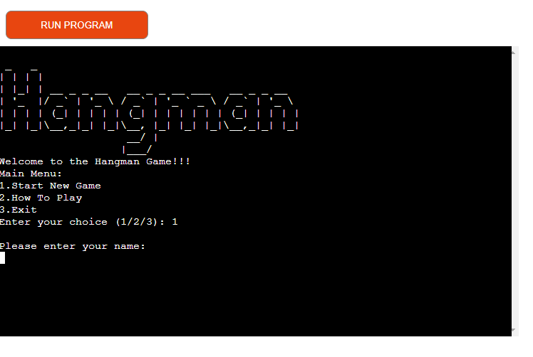
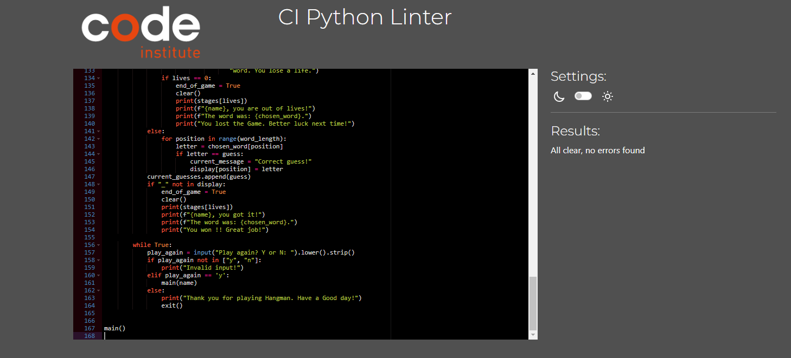
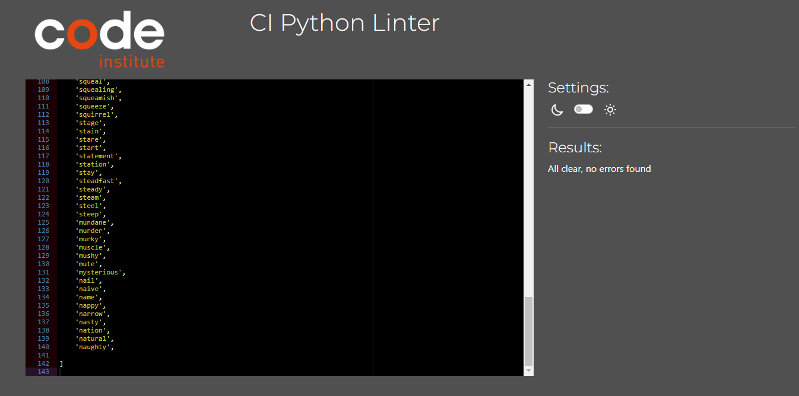
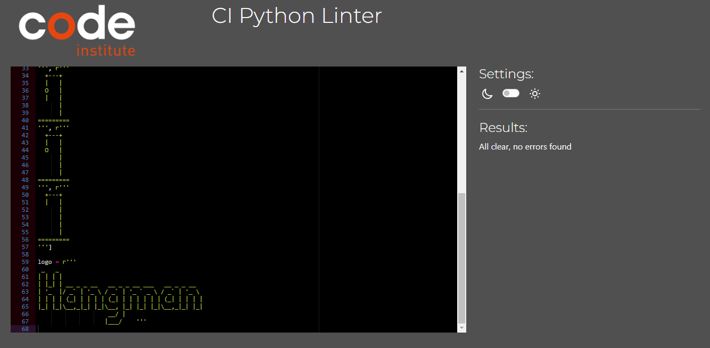

# Hangman Game!!

##  Hangman - The Word-Guessing Game

Hangman game is a word guessing game in which you must guess words before the hangman drawing is complete that challenges word knowledge and puzzle solving skills.In this timeless pastime you will need to identifiy a hidden word one letter at a time before the hangman is completely drawn.

## User experience

### Project OVERVIEW

- The aim of this site is to test the user's knowledge on word.

- Is to provide a user with an interesting game that interacts with the user as much as possible with features such as an option for the user to put his name which will be shown on the game screen.

# UX Design

## User Stories

### As a first time user

- I want to be able to know the rules of the game.
- Quickly understand the concept and rules of the game, even if I've never played Hangman before.
- I want to be able to play a fun, interactive game that will entertain me.
- I want the game to show my progress in the game either by winning or losing.
- I want a warning message to appear on the screen if I accidentally enter an invalid  
  character, number or just repeat the letter I used already.
- Easily navigate the game's main menu and options.
  Know how to start a new game or access any additional features.
- I want to be able to display correct word if i failed to guess the word.
- I want to be able to have the option to play again or not.

### As a Returning user

- I want the site to be compatible to different devices in times i want to play.
- Easily pick up where I left off in any ongoing games from my previous visit.
- Continue improving my word-guessing skills and enjoy the sense of progress and accomplishment.
- I want to experience a refreshed and randomized order of questions in each game to prevent memorising and manitain the element of surprise.
- I would like to have the option of choosing a variety of quizzes in different subject areas.
- Be motivated to return to the game and continue my Hangman adventure.

## How To Play

Start a New Game: Begin a new game and prepare to uncover the mystery word.

Guess the Word: Guess the letters that you believe are part of the hidden word. If your guess is correct, the letter will be revealed in its respective position(s). If you guess incorrectly, a part of the hangman will be drawn as a penalty.

Word Completion: Your goal is to reveal the entire word before the hangman figure is completed. Make sure to guess the word correctly within a limited number of attempts to win the game.

Strategy and Skill: Use your knowledge of words, common letters, and the context of the game to make educated guesses. Every incorrect guess brings you closer to the hangman's completion!

### Hangman Rules:

You have a set number of attempts to guess the word correctly.
For each incorrect letter guess, a part of the hangman (a stick figure) is drawn.
The game is over if the hangman figure is fully drawn before you guess the word.
You win the game if you guess the word before the hangman is complete.

### Are Yor Ready For The Challenge?

Hangman is a game that tests your vocabulary and word recognition skills while providing hours of fun and entertainment. Whether you're a word wizard or just looking for a fun way to pass the time, Hangman is the perfect choice. So, what are you waiting for? Start a new game!! Good luck!!!

## Game Features

1. Game Starting Page

2. Enter User Name

3.Playing Game Page

4.How To Play

5.Winning Page

6.Numbers

7.Special & Other Character

8.Exit Screen

## Flowchart

## Languages used

* [Python](https://www.python.org/): the main language used to create the game.

## Testing

- Passes the code through a PEP8 linter and there were few minor errors.
- Given invalid inputs:numbers & special characters when strings are expected,out of bounds inputs,same input twice.
- Tested in my local terminal and the Code Institute terminal.
- Tested Menu input by entering space bar " " it was throwing the error.Fixed the error.

## Bugs

- Ran the code through PEP8 linter, but i was getting few errors. Most of them were space, tabs, and line too long and trailing whitespace. I was able to fix these erorrs. 
- Tested the menu input section by entering invalid entries ans spaces.Fixed input menu validation to handle spaces and invalid entries.

## Validation

- PEP8 
   - No errors were returned from PEP8onine.com

1. Python Run.py Report

2. Python Words.py Report

3. Python Hangman_picture.py Report

## Deployment 

This website was coded in gitpod and deployed on [Heroku](https://hangman-game-app-500e6518507f.herokuapp.com/)

This project was deployed using Code Institute's mock terminal for Heroku.

- Steps for deployment:
   - Fork or clone this repository
   - Log in to Heroku and click "New" and "Create new app"
   - Name the new app and click "Create new app".
   - While still in "Settings", click "Reveal Config Vars" and add the following; KEY: PORT, VALUE: 8000. and content from creds.json file
   - Click on "Deploy" and select your deploy method and search for the repository name.
   - Click "Connect" on a selected repository.
   - Either choose "Enable Automatic Deploys" or "Deploy Branch" in the manual deploy section.
   - Heroku will now deploy the app.

##  Credits & Acknowledgements

- Code Institute for the deployement terminal.
- I would like to thank my Mentor Spencer Barriball for his guidance on making this project, he helped me provide guidance on features 
  for my Hangman Game project and pointed me to the right direction.
- [MJcodes]https://www.youtube.com/@mjcodes4071) for the ideas and how to start the project.
- [Apna College](https://www.youtube.com/@ApnaCollegeOfficial) for the Python concepts to understand.

